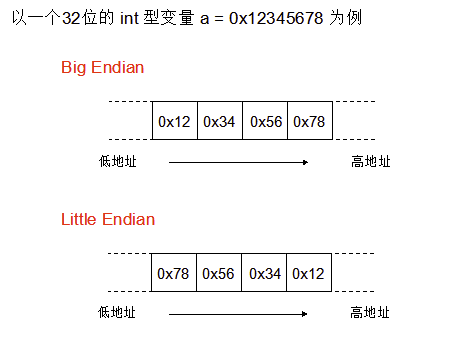

# mp4_parser
parse mp4 file in json format, written by golang
input: can be local mp4 file or http url, such as "http://xxxx.mp4"
output: json format to stdout and web api

## build

1. cd mp4_parser
1. go build .
1. ./mp4_parser

### 协议翻译
https://www.cnblogs.com/abnk/p/13614828.html

### terms

#### big endian and little endian
* https://www.gobeyond.dev/encoding-binary/
* big endian, 大端，高字节在低地址（the most significant comes first），通常用在network protocol，mp4协议中使用大端。可以直接用于比较数值.
* little endian, 小端，低字节在低地址, cpu中存储数据使用此模式。优点是方便转换数据类型
* !

#### ftyp, File Type Box
* ftyp, Mandatory, and Exactly one, shall occur before any variable-length box.

> all header boxes be placed first in the container
#### moov, container for all the metadata

#### mdat

#### free
* the contents of a free-space box are irrelevant and may be ignored, or the object deleted, without affecting the presentation.(Care should be exercised when deleting the object, as this may invalidate the offsets used in the sample table, unless this object is after all the media data)

#### packet 与 frame的区别
